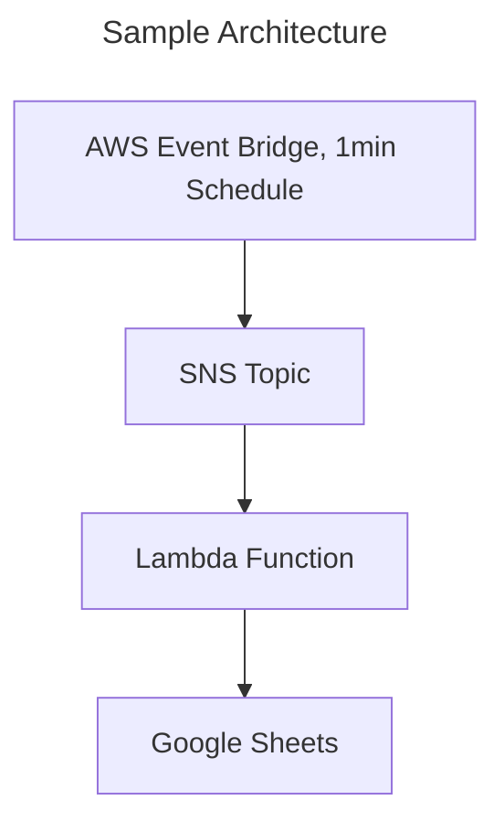

# Lambda function that adds to google spread sheet, built with CDK

- The `credentials.json` has credentials to call google sheets API.
- The `cdk.json` file tells the CDK toolkit how to execute your app.
- The `.env` environment file should contain environment variables for synthesizing.
  Take a look at `.env.example` file.

## Useful commands

- `cdk deploy` deploy this stack to your default AWS account/region
- `cdk diff` compare deployed stack with current state
- `cdk synth` emits the synthesized CloudFormation template
- `go test` run unit tests
